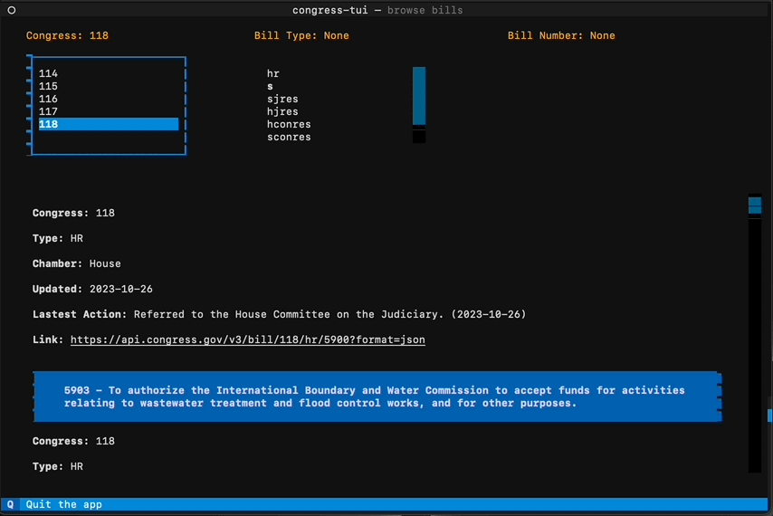

# congress-tui

---



## Congress API
A Terminal User Interface (TUI) for https://api.congress.gov/

On GitHub: https://github.com/LibraryOfCongress/api.congress.gov/

Blog announcement: https://blogs.loc.gov/law/2022/09/introducing-the-congress-gov-api/

This app uses a demo API key that has various limitations. You can sign up for your own key here: https://api.congress.gov/sign-up/
and set an environment variable `GOV_API_KEY` to that value before running the app.

Bill type descriptions: https://www.govinfo.gov/help/bills

## Textual

This is written in python using [Texutalize](https://www.textualize.io/)

GitHub: https://github.com/Textualize/textual/tree/main

Changelog Interview: https://changelog.com/podcast/511

### Textual-Web

Textual recently launched a tool in beta that allows you to publish your TUI apps on the web.

See: https://github.com/textualize/textual-web

Once you have installed it, you can run `textual-web --config serve.toml` to create a browser instance.

## Installation
Requires Python 3.8+

### Using pipx

Since this package is still in development and not ready for release,
the simplest way to install it is with pipx.

```shell
$ pipx install git+https://github.com/bmckinney/congress-tui.git
```

Once installed with pipx you will have the `congress-tui` cli added to `~/.local/bin/`. 
Assuming `~/.local/bin/` is part of your `PATH` variable you can simply run `congress-tui` in your terminal.

### Using Poetry
```shell
$ curl -sSL https://install.python-poetry.org | python3 -
$ poetry install
$ poetry run congress-tui
```

## TODO
- implement pagination
- tabbed interface to add other content types: committee reports, etc.
- custom links (e.g.: from sponsor to member details)
- add tests

## Other TUI Libraries

- [ratatui](https://github.com/ratatui-org/ratatui) (rust)
- [bubbletea](https://github.com/charmbracelet/bubbletea) (golang)
- [pterm](https://github.com/pterm/pterm) (golang)
- [blessed](https://github.com/chjj/blessed) (javascript)

## Additional Information

- [List of projects that provide TUIs](https://github.com/rothgar/awesome-tuis)
- [Textualize App Gallery](https://www.textualize.io/projects/)
- [A longer list of Textualize apps and libraries](https://github.com/davep/transcendent-textual)